<div align="center">

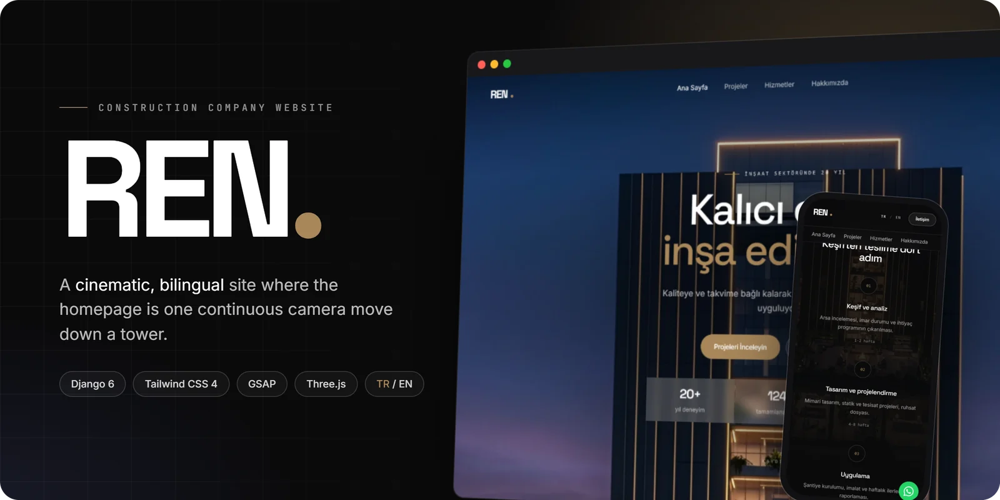

<h3>A cinematic, bilingual website for a construction company</h3>

<p>Built with Django 6 and Tailwind CSS 4. The homepage is one scroll-driven camera move down a tower: into the clouds, past the <b>REN</b> wordmark, and down to the entrance.</p>

<p>
  
  
  
  
  
  
  
</p>

<a href="#the-opening-shot">Opening shot</a> ·
<a href="#features">Features</a> ·
<a href="#screenshots">Screenshots</a> ·
<a href="#getting-started">Getting started</a> ·
<a href="#under-the-hood">Under the hood</a>

</div>

<br>

## The opening shot

<p align="center">
  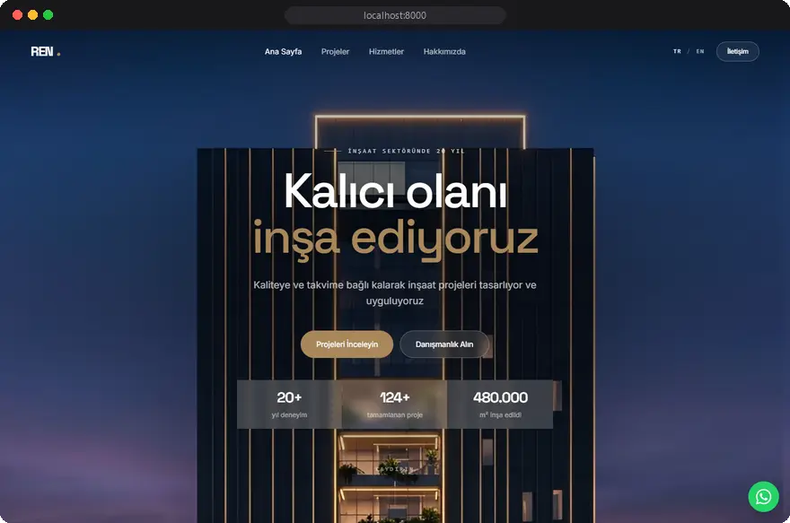
</p>

The hero turns an uploaded architectural render into a single camera move. You start at the crown of the tower, descend into a procedural cloud deck, see the **REN** wordmark surface inside the fog, and come to rest at the entrance as the "how we work" timeline rises into frame.

<table>
  <tr>
    <td width="50%">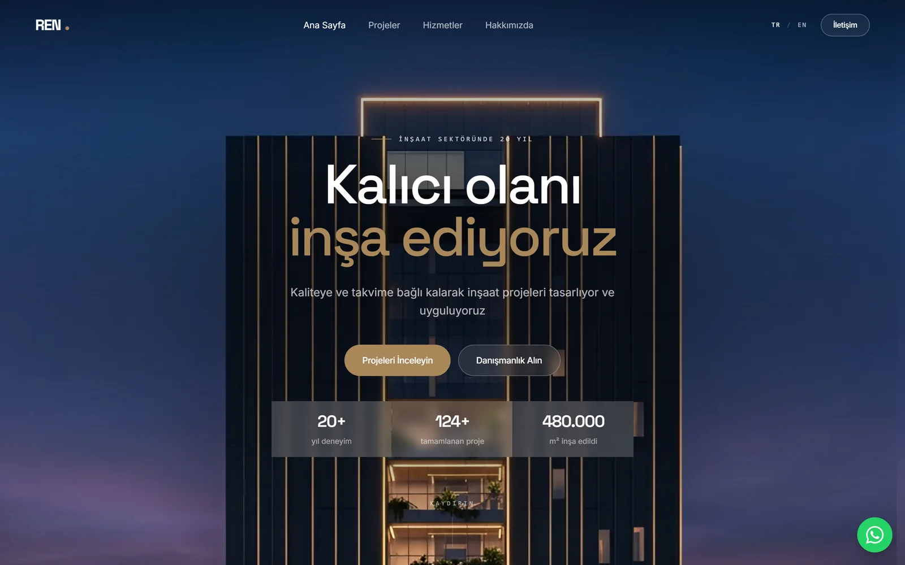<p align="center"><sub><code>t = 0</code> · title over the crown</sub></p></td>
    <td width="50%">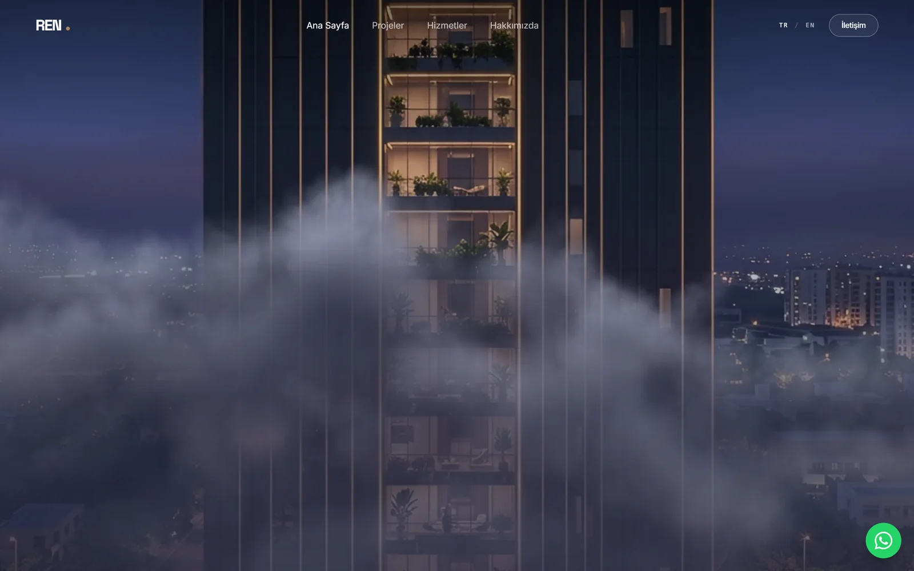<p align="center"><sub><code>t ≈ 0.5</code> · into the cloud deck</sub></p></td>
  </tr>
  <tr>
    <td width="50%">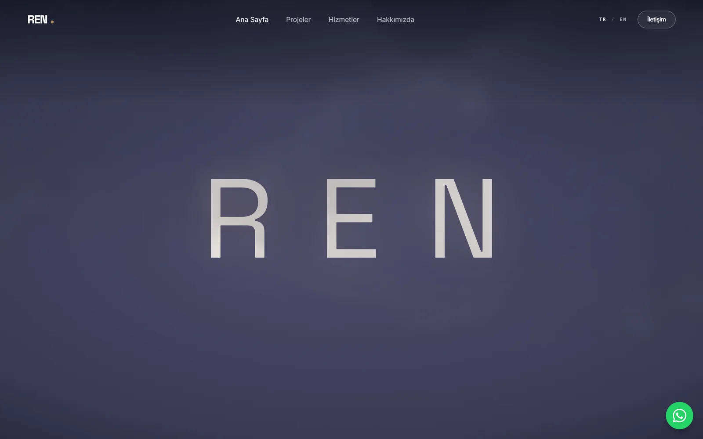<p align="center"><sub><code>t ≈ 0.7</code> · the wordmark surfaces</sub></p></td>
    <td width="50%">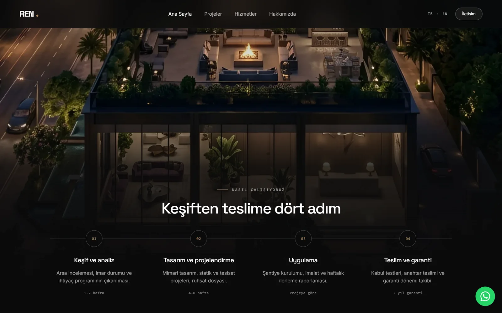<p align="center"><sub><code>t = 1</code> · arrival on the process steps</sub></p></td>
  </tr>
</table>

## Features

- **Cinematic scroll hero.** A CSS-sticky stage scrubbed by one GSAP ScrollTrigger. Only `transform`, `opacity` and `filter` change per frame. Colours sampled from the render's edges extend the sky on ultra-wide screens, a sky-only layer adds parallax, and phones get their own closer framing.
- **Procedural 3D fallback.** With no render uploaded, a Three.js tower built from primitives turns as you scroll. three.js is only loaded on that path.
- **Progressive enhancement.** Without JavaScript, or with `prefers-reduced-motion`, the hero becomes a still screen. Focus rings stay visible.
- **Bilingual (TR / EN).** Turkish lives at `/` and English at `/en/`. UI strings use gettext, and database content uses optional `_en` fields that fall back to Turkish. The language switcher keeps you on the same page, and `hreflang` alternates are included.
- **Managed from the Django admin.** Projects (gallery, before/after images, featured flag, ordering), services, process steps, client references and certificates, plus a singleton *Site settings* row for company details, the hero render, homepage stats and a WhatsApp number.
- **Portfolio.** Category filter, project detail pages with a facts table, gallery and related projects.
- **Motion details.** A drag-to-compare before/after slider (GSAP Draggable), scroll-reveal clip-path image masks, and animated stat counters.
- **Contact form.** Messages are saved to the admin with an optional email notification that can never break a submission. Persian and Arabic-Indic digits in phone numbers are normalised.
- **SEO.** i18n sitemap, `robots.txt`, canonical URLs, Open Graph and Twitter cards, and `GeneralContractor` JSON-LD.
- **No bundler, no CDN.** GSAP and three.js ES modules are served from `static/vendor` through an import map. `optimize_images` writes WebP siblings that templates prefer via `<picture>`.
- **KVKK cookie notice** and a floating **WhatsApp** button.

## Screenshots

### Desktop

<table>
  <tr>
    <td width="50%">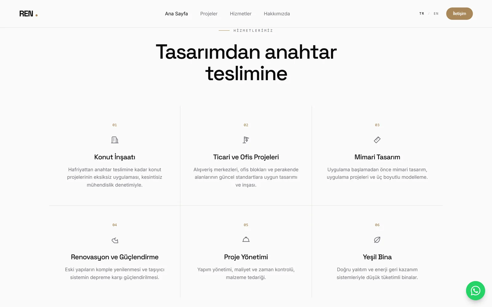<p align="center"><sub>Services</sub></p></td>
    <td width="50%">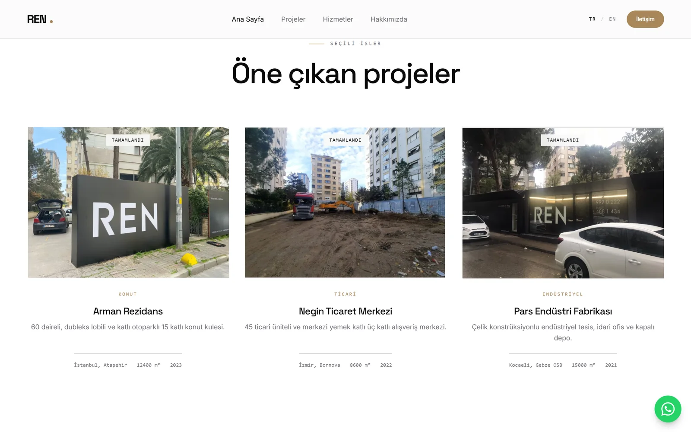<p align="center"><sub>Featured projects</sub></p></td>
  </tr>
  <tr>
    <td width="50%">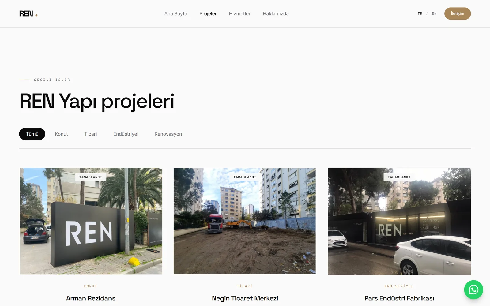<p align="center"><sub>Projects with category filter</sub></p></td>
    <td width="50%">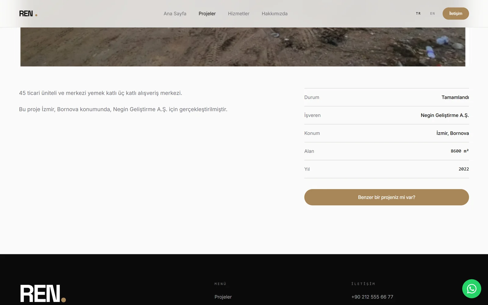<p align="center"><sub>Project detail</sub></p></td>
  </tr>
  <tr>
    <td width="50%">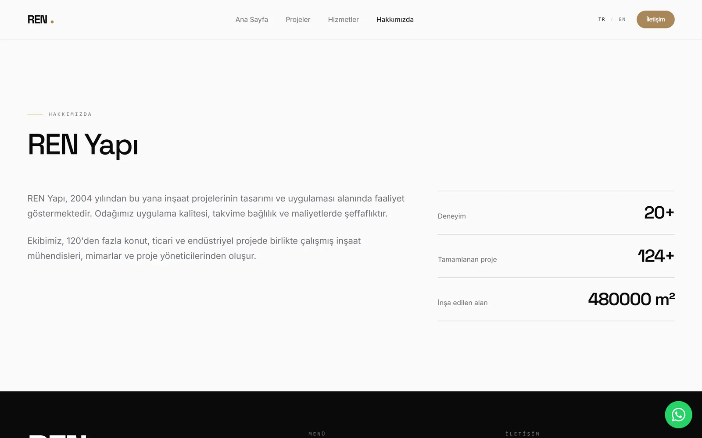<p align="center"><sub>About</sub></p></td>
    <td width="50%">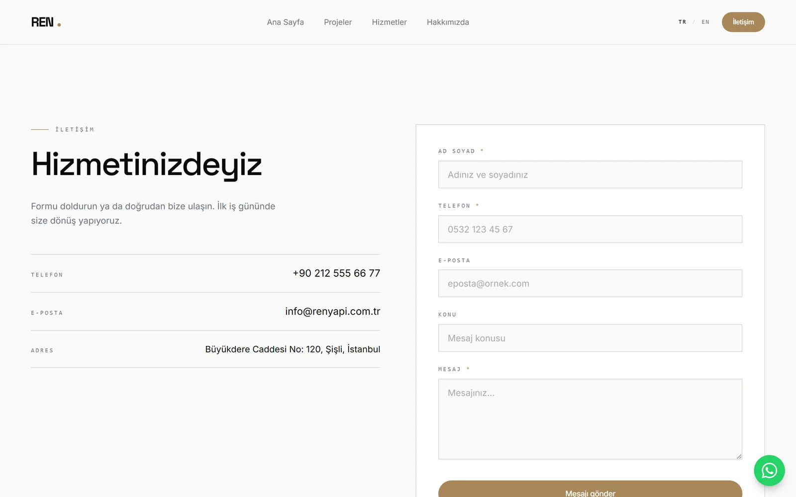<p align="center"><sub>Contact</sub></p></td>
  </tr>
</table>

### Mobile

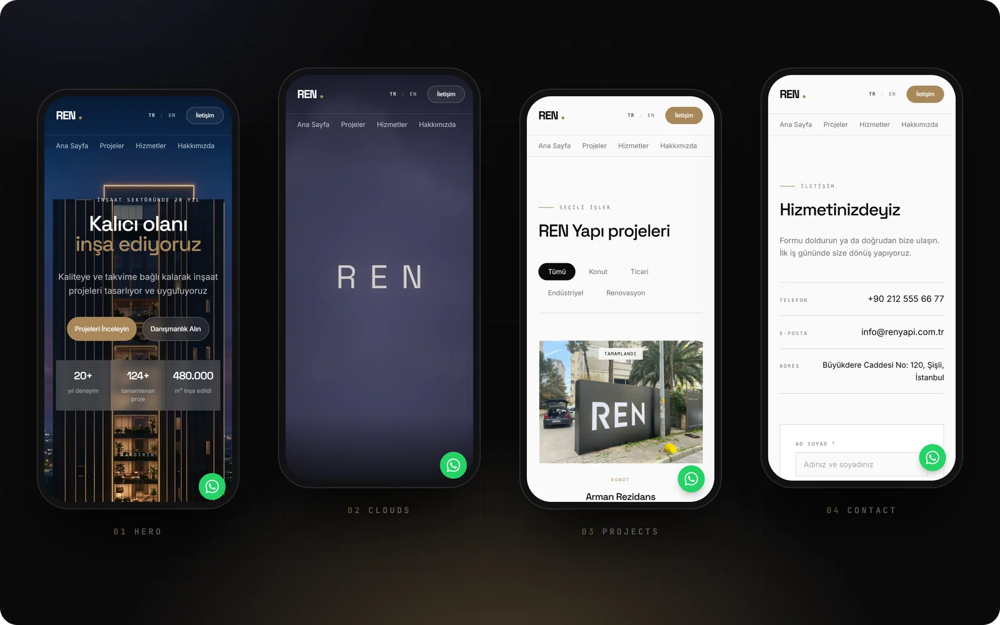

### Türkçe / English

<table>
  <tr>
    <td width="50%"><p align="center"><sub>Türkçe · <code>/</code></sub></p></td>
    <td width="50%">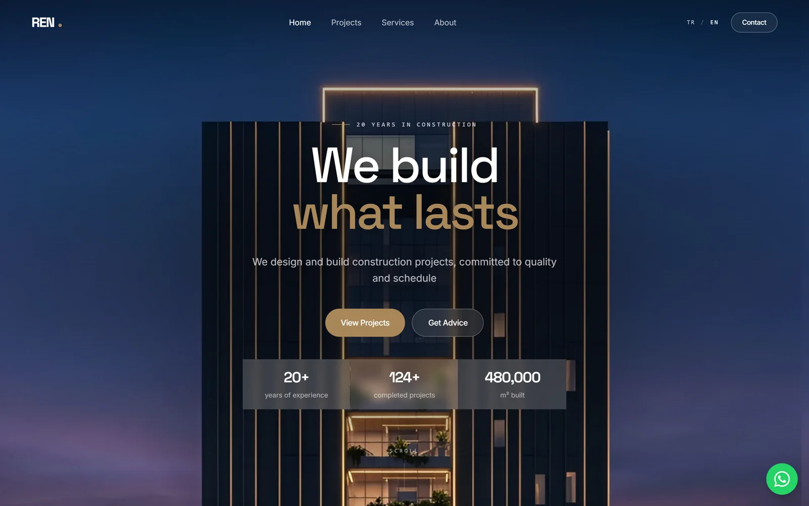<p align="center"><sub>English · <code>/en/</code></sub></p></td>
  </tr>
</table>

## Tech stack

| Layer | Tools |
| --- | --- |
| Backend | Python 3.13, Django 6.1, SQLite |
| Frontend | Django templates, Tailwind CSS 4 (CSS-first `@theme`), native ES modules + import map |
| Motion & 3D | GSAP 3 (ScrollTrigger, Draggable), Three.js |
| Images | Pillow: WebP optimisation and procedural cloud sprites |
| i18n | Django gettext, `i18n_patterns` |

## Getting started

Requires **Python 3.13+** and **Node.js 20+**. Node is only used to build the CSS and copy vendor modules.

```bash
git clone <repository-url> ren
cd ren

python -m venv .venv
# Windows: .venv\Scripts\activate    macOS / Linux: source .venv/bin/activate
pip install -r requirements.txt

npm install        # also copies GSAP + three.js into static/vendor
npm run build      # Tailwind CSS

python manage.py migrate
python manage.py seed_demo          # demo company, services, projects, steps, references
python manage.py createsuperuser
python manage.py runserver
```

Open <http://127.0.0.1:8000> (Turkish) or <http://127.0.0.1:8000/en/> (English). The admin is at `/admin/`.

> [!NOTE]
> The demo data has no images. Without a hero render the homepage shows the Three.js tower. Upload a tall render under **Admin → Site settings → Hero image** to switch to the cinematic film, then run `python manage.py optimize_images`. If you use a different render, retune the `--cine-*` values in `main/templates/main/_cinematic_hero.html`.

### Configuration

| Variable | Default | Notes |
| --- | --- | --- |
| `DJANGO_SECRET_KEY` | development placeholder | Set a long random value in production |
| `DJANGO_DEBUG` | `1` | Set to `0` in production |

Before deploying, also restrict `ALLOWED_HOSTS`, run `collectstatic`, and serve `media/` from your web server.

### Useful commands

| Command | What it does |
| --- | --- |
| `python manage.py seed_demo` | Idempotent demo content |
| `python manage.py optimize_images [--quality 82] [--force]` | Writes `.webp` siblings for uploaded images |
| `python manage.py test` | Runs the test suite |
| `npm run css:dev` | Tailwind in watch mode |
| `npm run build` | Re-copies vendor modules and builds minified CSS |
| `python scripts/generate_clouds.py` | Regenerates the procedural cloud sprites |

## Under the hood

The film is a pure function of one number: scroll progress `t` from 0 to 1 (`static/js/cinematic-hero.js`). Nothing is sequenced, so scenes can overlap freely and scrolling back replays the same frames in reverse.

| `t` | Scene |
| --- | --- |
| 0.00 – 0.04 | the scroll cue clears |
| 0.03 – 0.22 | the title rides up with the sky and fades |
| 0.30 – 0.56 | haze thickens; the first cloud banks rise into frame |
| 0.50 – 0.62 | fog closes over the lens |
| 0.58 – 0.72 | **REN** surfaces through the fog |
| 0.76 – 0.94 | the banks part; near veils rush past the lens |
| 0.88 – 1.00 | the ground fade hands over to the next section |

## Project structure

```text
.
├── config/                  settings, root URLs (i18n_patterns), WSGI / ASGI
├── main/                    the site app
│   ├── models.py            SiteSettings, Service, Project, ProjectImage, ProcessStep, Reference, ContactMessage
│   ├── views.py             pages and the contact form
│   ├── admin.py             admin with collapsible English fieldsets
│   ├── management/commands  seed_demo, optimize_images
│   ├── templatetags/        |t translation filter, |webp, language switch URLs
│   ├── templates/main/      pages and partials (cinematic hero, before/after, reveal masks…)
│   └── tests.py
├── templates/               base layout, 404 / 500, robots.txt
├── static/
│   ├── src/input.css        Tailwind theme and hero styles
│   ├── js/cinematic-hero.js
│   └── img/cine/            procedural cloud sprites
├── locale/                  tr / en translations
├── scripts/                 sync-vendor.mjs, generate_clouds.py
└── docs/                    README images
```
